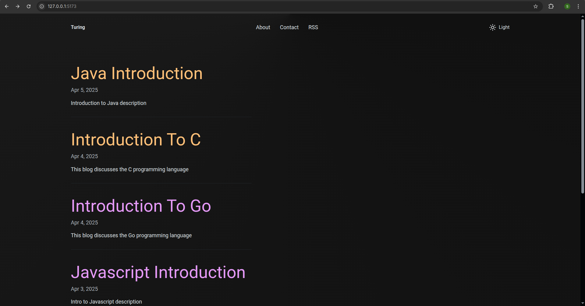
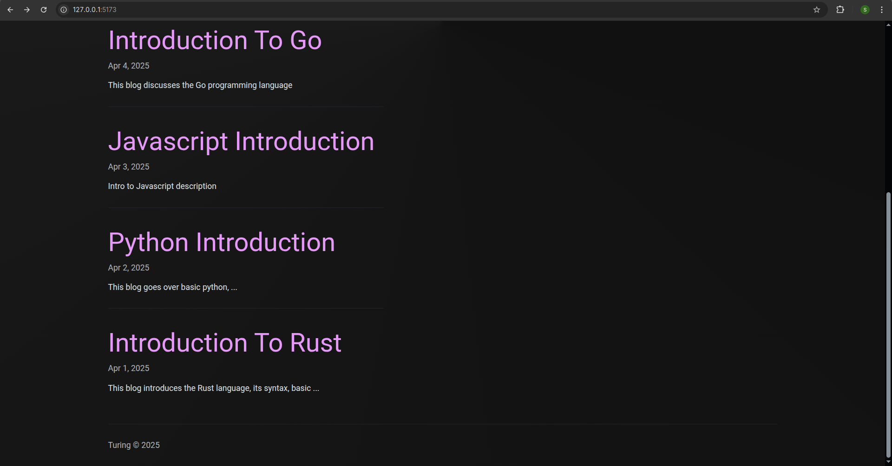
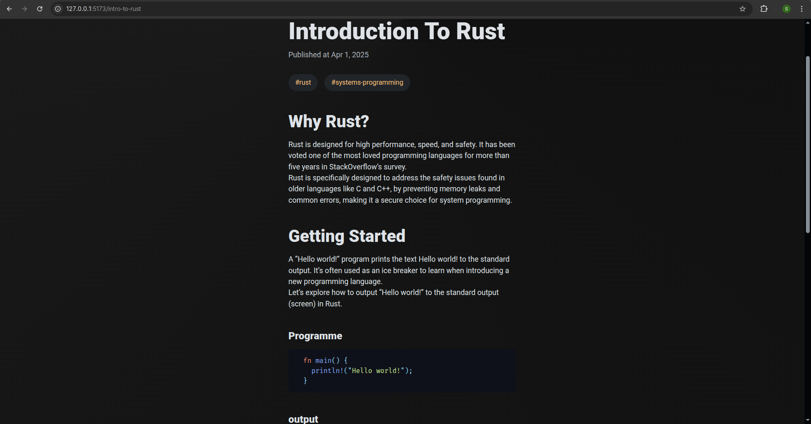
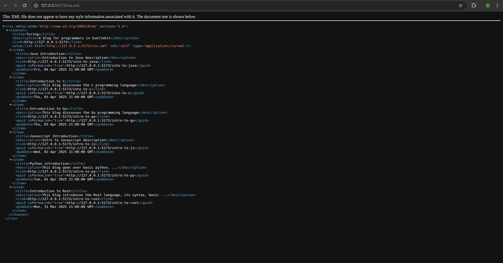

# Turing - A Markdown Blog using SvelteKit

A minimalist, feature-rich blog platform built with SvelteKit that renders content from Markdown files.



## Features

- 📝 Markdown-based content with code syntax highlighting via Shiki
- 🔄 RSS feed support
- 🔍 Category-based post filtering
- 🌓 Light/Dark theme toggle
- 🚀 Fast and responsive design
- 📱 Mobile-friendly interface
- 📖 Table of Contents generation for posts

## Screenshots

### Post View


### Rust Post Example


### RSS Feed


## Project Structure

```
.
├── assets              # Project screenshots/assets
├── src
│   ├── lib             # Shared utilities and components
│   ├── posts           # Markdown blog posts
│   ├── routes          # SvelteKit routes (pages and API endpoints)
│   └── app.css         # Global styles
└── static              # Static assets served as-is
```

## Technology Stack

- **Framework**: SvelteKit
- **Markdown Processing**: MDsveX
- **Syntax Highlighting**: Shiki
- **Styling**: Open Props
- **Icons**: Lucide Svelte
- **Fonts**: Fira Code & Roboto

## Getting Started

### Prerequisites

- Node.js (v16+)
- PNPM (v10+)

### Installation

1. Clone this repository
   ```bash
   git clone https://github.com/yourusername/turing-blog.git
   cd turing-blog
   ```

2. Install dependencies
   ```bash
   pnpm install
   ```

3. Start the development server
   ```bash
   pnpm dev
   ```

4. Open your browser and navigate to `http://localhost:5173`

## Adding New Posts

Create a new Markdown file in the `src/posts` directory:

```markdown
---
title: My New Post
description: A brief description of the post
date: '2025-04-08'
categories:
  - tutorial
  - javascript
published: true
---

# Table of Contents

## Introduction

Your content here...

## Code Example

```js
console.log('Hello, world!');
```

## Building for Production

```bash
pnpm build
```

The build output will be in the `.svelte-kit/output` directory.

## Preview Production Build

```bash
pnpm preview
```

## Configuration

The blog can be configured by editing the `src/lib/config.ts` file:

```typescript
export const title = "Turing";
export const description = "A blog for programmers in Sveltekit";
export const url = dev ? "http://127.0.0.1:5173" : "your-production-url.com";
```

## Deployment

This project can be deployed to any platform that supports SvelteKit, such as:

- Vercel
- Netlify
- Cloudflare Pages
- Any static hosting service

## License

This project is licensed under the MIT License - see the LICENSE file for details.

## Acknowledgements

- [SvelteKit](https://kit.svelte.dev/)
- [MDsveX](https://mdsvex.com/)
- [Shiki](https://shiki.style/)
- [Open Props](https://open-props.style/)